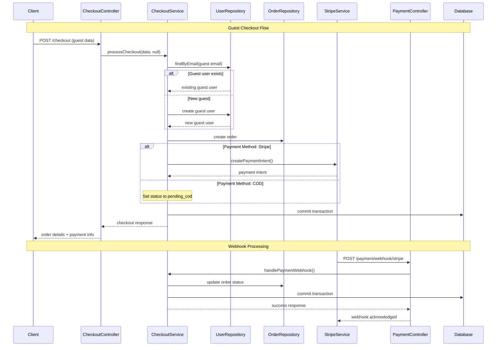

# NestJS E-commerce: Orders, Checkout & Payment Flow

## Overview

This document describes the complete flow of Orders, Checkout, and Payment in our NestJS e-commerce application. The system supports both guest and authenticated user checkouts, multiple payment methods (COD, Stripe, Paymob), and comprehensive webhook handling for payment status updates.

## System Architecture Diagram



## Entities & Data Models

### User Entity

The existing `User` model supports multiple authentication providers through the `provider` field:

```typescript
export enum SystemRoles {
  SYSTEM = 'system',
  LOCAL = 'local',
  GUEST = 'guest',
  GOOGLE = 'google',
  FACEBOOK = 'facebook',
}

export class User {
  userName: string;
  email: string;
  password?: string; // Optional for guest/social users
  phone?: string;
  provider: SystemRoles; // Distinguishes user types
  role: RoleTypes; // USER, ADMIN, SUPER_ADMIN
  isConfirm: boolean;
  // ... other fields
}
```

### Order Entity

The `Order` entity includes all required fields for comprehensive order management:

```typescript
export enum OrderStatus {
  PENDING = "pending",
  PENDING_COD = "pending_cod", 
  PLACED = "placed",
  ON_WAY = "on_way",
  DELIVERED = "delivered",
  REJECTED = "rejected",
  PAID = "paid",
  FAILED = "failed"
}

export class Order {
  userId: Types.ObjectId; // Reference to User
  totalAmount: number;
  currency: Currency; // USD, EGP
  status: OrderStatus;
  payment_gateway: string; // 'stripe', 'paymob', 'cod'
  payment_token: string; // Payment intent ID or transaction token
  idempotency_key: string; // UUID for preventing duplicates
  createdAt: Date;
  
  // Cart items
  items: CartItem[];
  
  // Shipping information (for guest users)
  shippingInfo?: ShippingInfo;
  
  // Payment metadata
  payment_metadata: any;
  
  // Additional fields
  couponId?: Types.ObjectId;
  originalAmount?: number;
  discountAmount?: number;
  // ... other fields
}
```

## Modules Architecture

### OrdersModule
- **Purpose**: Manages order lifecycle (create, update, status tracking)
- **Components**: OrderRepository, Order schema
- **Responsibilities**: CRUD operations, order status management, order queries

### CheckoutModule
- **Purpose**: Orchestrates checkout process for guest and authenticated users
- **Components**: CheckoutController, CheckoutService, CheckoutDTOs
- **Responsibilities**: User validation, order creation, payment processing coordination

### PaymentModule
- **Purpose**: Handles integration with Stripe and Paymob via webhooks
- **Components**: PaymentController, StripeService
- **Responsibilities**: Webhook processing, payment status updates, gateway integration

## Detailed Flow Descriptions

### 1. Guest Checkout Flow

**Endpoint**: `POST /checkout`

**Process**:
1. **Idempotency Check**: Verify `idempotency_key` to prevent duplicate orders
2. **Guest User Handling**:
   - Check if guest user exists by email with `provider = 'guest'`
   - If exists: Update user information
   - If new: Create guest user with `provider = 'guest'`
   - Validate email is not used by registered users
3. **Order Creation**:
   - Calculate total amount from cart items
   - Create order with `status = 'pending'` (or `'pending_cod'` for COD)
   - Store shipping information in order
4. **Payment Processing**:
   - **COD**: Set status to `pending_cod`, no payment processing
   - **Stripe**: Create payment intent, store `payment_token`
   - **Paymob**: (To be implemented)
5. **Transaction Commit**: All operations wrapped in database transaction

**Key Features**:
- Automatic guest user creation/reuse
- Email conflict prevention
- Comprehensive validation
- Transaction safety

### 2. Authenticated Checkout Flow

**Endpoint**: `POST /checkout/authenticated`

**Process**:
1. **Authentication**: JWT token validation via `AuthGuard`
2. **User Context**: Use authenticated user directly
3. **Order Creation**: Same as guest flow but without shipping info storage
4. **Payment Processing**: Identical to guest checkout
5. **Response**: Return order details with payment information

**Differences from Guest**:
- No guest user creation
- No shipping info storage (use user profile)
- Requires authentication

### 3. Cash on Delivery (COD) Flow

**Process**:
1. **Order Status**: Set to `pending_cod`
2. **No Payment Processing**: Skip payment gateway integration
3. **Manual Fulfillment**: Order awaits manual processing
4. **Status Updates**: Admin can update status through order management

### 4. Online Payment Flow (Stripe)

**Process**:
1. **Payment Intent Creation**:
   ```typescript
   const paymentIntent = await stripeService.createPaymentIntent({
     amount: Math.round(amount * 100), // Convert to cents
     currency: currency.toLowerCase(),
     metadata: {
       orderId: order._id.toString(),
       userId: user._id.toString(),
       userEmail: user.email,
     }
   });
   ```
2. **Order Update**: Store `payment_token` and `client_secret`
3. **Client Processing**: Frontend handles payment confirmation
4. **Webhook Handling**: Stripe sends webhook for status updates

### 5. Webhook Processing Flow

**Stripe Webhook** (`POST /payment/webhook/stripe`):
1. **Signature Verification**: Validate webhook authenticity
2. **Event Processing**:
   - `payment_intent.succeeded` → Set order status to `paid`
   - `payment_intent.payment_failed` → Set order status to `failed`
3. **Order Update**: Update order with payment metadata
4. **Transaction Safety**: All updates wrapped in database transaction

**Paymob Webhook** (`POST /payment/webhook/paymob`):
- Similar structure to Stripe
- Currently basic implementation (to be enhanced)

**Generic Webhook** (`POST /payment/webhook`):
- Handles any payment gateway
- Flexible payload processing

## API Endpoints Summary

| Method | Endpoint | Description | Authentication |
|--------|----------|-------------|----------------|
| `POST` | `/checkout` | Process guest checkout | Optional |
| `POST` | `/checkout/authenticated` | Process authenticated user checkout | Required |
| `GET` | `/checkout/order/:orderId/status` | Get order status (guest) | None |
| `GET` | `/checkout/order/:orderId/status/authenticated` | Get order status (authenticated) | Required |
| `POST` | `/payment/webhook/stripe` | Stripe webhook handler | None |
| `POST` | `/payment/webhook/paymob` | Paymob webhook handler | None |
| `POST` | `/payment/webhook` | Generic webhook handler | None |

## Request/Response Examples

### Guest Checkout Request
```json
{
  "items": [
    {
      "id": "product_123",
      "title": "Sample Product",
      "price": 29.99,
      "quantity": 2,
      "image": "https://example.com/image.jpg",
      "size": "M",
      "color": "Blue"
    }
  ],
  "guestInfo": {
    "firstName": "John",
    "lastName": "Doe",
    "email": "john.doe@example.com",
    "phone": "+1234567890",
    "address": "123 Main St",
    "city": "New York",
    "postalCode": "10001"
  },
  "paymentMethod": "stripe",
  "currency": "USD",
  "idempotencyKey": "550e8400-e29b-41d4-a716-446655440000"
}
```

### Checkout Response
```json
{
  "success": true,
  "message": "Checkout completed successfully",
  "orderId": "64a7b8c9d1e2f3a4b5c6d7e8",
  "userId": "64a7b8c9d1e2f3a4b5c6d7e9",
  "totalAmount": 59.98,
  "currency": "USD",
  "status": "pending",
  "clientSecret": "pi_1234567890_secret_abcdef",
  "paymentToken": "pi_1234567890"
}
```

## Technical Considerations

### Security Best Practices

1. **No Raw Card Data Storage**: Only payment tokens/IDs are stored
2. **Webhook Signature Verification**: All webhooks verified for authenticity
3. **Authentication Guards**: Protected endpoints use JWT authentication
4. **Input Validation**: Comprehensive DTO validation with class-validator
5. **SQL Injection Prevention**: MongoDB with Mongoose ODM

### Data Integrity

1. **Idempotency Keys**: UUID-based duplicate prevention
2. **Database Transactions**: All multi-step operations wrapped in transactions
3. **Rollback Support**: Automatic rollback on errors
4. **Optimistic Locking**: Mongoose versioning for concurrent updates

### Error Handling

1. **Structured Exceptions**: Custom exception classes for different scenarios
2. **Validation Errors**: Detailed validation feedback via DTOs
3. **Payment Failures**: Graceful handling of payment gateway errors
4. **Webhook Failures**: Retry mechanisms and error logging

### Performance Optimizations

1. **Strategic Indexing**: Compound indexes for common query patterns
2. **Connection Pooling**: MongoDB connection optimization
3. **Caching**: Redis integration for session management
4. **Async Processing**: Non-blocking webhook processing

### Monitoring & Logging

1. **Structured Logging**: JSON-formatted logs for better parsing
2. **Error Tracking**: Integration with error monitoring services
3. **Metrics Collection**: Order processing metrics and KPIs
4. **Webhook Monitoring**: Track webhook success/failure rates

## Environment Configuration

### Required Environment Variables

```env
# Database
MONGODB_URI=mongodb://localhost:27017/ecommerce

# Stripe
STRIPE_SECRET_KEY=sk_test_...
STRIPE_WEBHOOK_SECRET=whsec_...

# Paymob (when implemented)
PAYMOB_API_KEY=...
PAYMOB_WEBHOOK_SECRET=...

# Security
JWT_SECRET=your-jwt-secret
PHONE_ENC=your-phone-encryption-key
```

## Future Enhancements

1. **Paymob Integration**: Complete implementation of Paymob payment gateway
2. **Order Tracking**: Real-time order status updates via WebSocket
3. **Inventory Management**: Stock validation during checkout
4. **Coupon System**: Enhanced discount and promotion handling
5. **Multi-currency Support**: Dynamic currency conversion
6. **Subscription Payments**: Recurring payment support
7. **Refund Processing**: Automated refund handling
8. **Analytics Dashboard**: Order and payment analytics

## Testing Strategy

1. **Unit Tests**: Service layer business logic testing
2. **Integration Tests**: Database and external service integration
3. **E2E Tests**: Complete checkout flow testing
4. **Webhook Testing**: Mock webhook event processing
5. **Load Testing**: Performance under high checkout volumes

This documentation provides a comprehensive overview of the order, checkout, and payment system. The implementation follows NestJS best practices and provides a robust foundation for e-commerce operations.